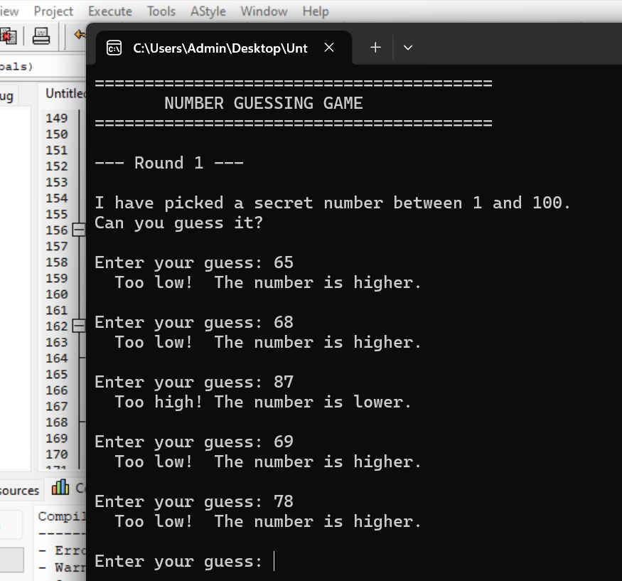
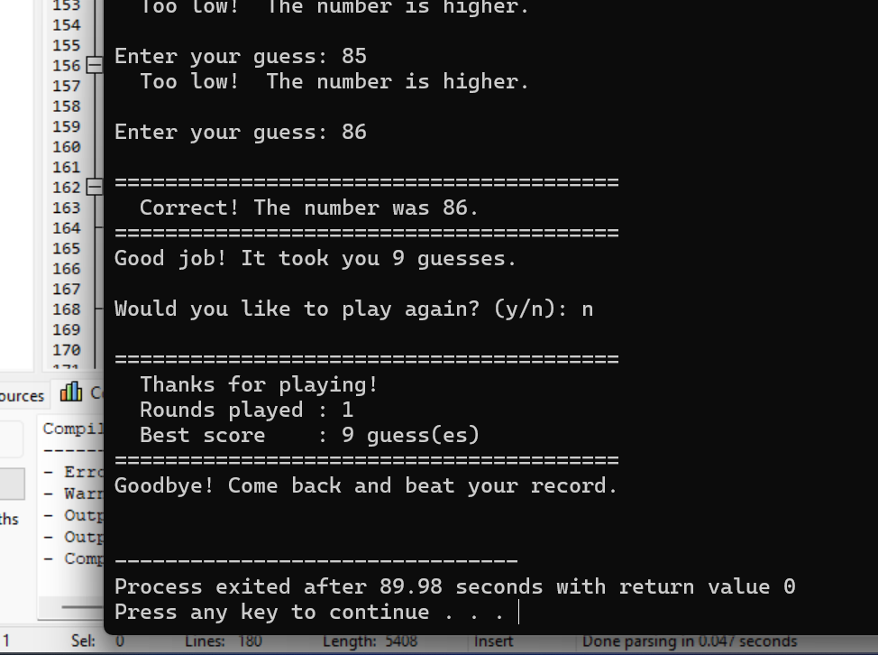

# Number Guessing Game in C

A console-based game built in C where the computer picks a random number between 1 and 100 and you try to guess it. Simple concept — but building it properly over 3 days taught me more about C than I expected.

---

## Screenshots





---

## Why I Built This

I wanted a project small enough to actually finish but deep enough to learn from. This game covers the exact fundamentals I was studying — random number generation, loops, input handling, and clean function design — so it made sense to build it properly instead of just reading about it.

I also challenged myself to commit every single day for 3 days, adding one feature at a time, the way real developers actually work.

---

## What the Game Does

- Generates a random number between 1 and 100 every run
- Accepts your guess and tells you if it is too high or too low
- Counts how many attempts you take
- Gives different feedback depending on your score
- Rejects invalid input — letters, symbols, numbers out of range — without crashing
- Asks if you want to play again and tracks your best score across rounds

---

## How to Run It

**You need GCC installed. Check with:**
```bash
gcc --version
```

**Compile:**
```bash
gcc guessing_game.c -o guessing_game
```

**Run:**
```bash
./guessing_game
```

---

## How I Built It — 3 Day Commit History

I built this one feature at a time over 8 days. Each commit is a working version of the game.

**First — Project setup**
Created the file, wrote `main()`, printed the welcome banner. Just getting the structure right.

**Second — Constants**
Added `#define MIN_NUMBER` and `#define MAX_NUMBER` so the range is defined in one place and easy to change later. Small thing, but it is the right habit.

**Third — Random number**
Brought in `stdlib.h` and `time.h`. Used `srand(time(NULL))` to seed the generator so every run is different, then `rand() % 100 + 1` to get a number in range. Added a temporary debug print to confirm it was working, then removed it the next day.

**Fourth — Guessing loop**
Added the `do-while` loop and `scanf` to read input. The game was now actually playable for the first time — just with no hints yet.

**Fifth — Hints**
Added the `if / else if` comparison inside the loop. Too high, too low. Suddenly the game felt real.

**Sixth — Attempt counter**
Added `attempts++` on every guess and tiered praise at the end. Getting it in one guess gives a different message than taking fifteen.

**Seventh — Input validation**
This was the most interesting day. Wrote two helper functions: `clear_input_buffer()` to drain bad characters from stdin, and `get_valid_guess()` to keep prompting until the input is a real integer inside the valid range. Without this the game would crash or loop forever on bad input.

**Eight — Play again and best score**
Extracted the game logic into `play_one_game()`, added `ask_play_again()`, and wrapped everything in an outer loop. The game now tracks your best score across all rounds in a session.

---

## What I Learned

**`srand` and `rand`** — seeding matters. Without `srand(time(NULL))` you get the same number every single run.

**`do-while` vs `while`** — `do-while` is the right choice here because the player always needs at least one guess. I used to just reach for `while` automatically.

**Input validation is not optional** — typed `abc` into a `scanf("%d")` once and watched the program spin forever. Writing `clear_input_buffer()` and checking the return value of `scanf` fixed that completely.

**Helper functions keep `main()` readable** — by Day 7, `get_valid_guess()` handled all the messy input logic and `main()` stayed clean. I can see exactly why developers break things into functions even on small projects.

**Incremental commits build good habits** — committing one feature at a time meant I always had a working version to go back to. It also made me think more carefully about what each change was actually doing.

---

## Project Structure

```
number-guessing-game-c/
├── guessing_game.c
├── README.md
└── screenshots/
    ├── gameplay.png
    └── win-screen.png
```

---

## Tech

- **Language:** C (C99)
- **Compiler:** GCC
- **Libraries:** `stdio.h`, `stdlib.h`, `time.h` — standard library only, no external dependencies

---


---

*Built over 3 days as part of learning C fundamentals. Every commit is a real step — nothing was written all at once.*
